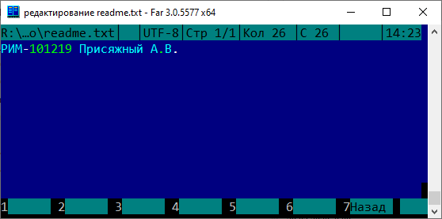

# 01. Практика. Контроль версий. GIT

## Подготовка

1. Поставить [Notepad++](https://notepad-plus-plus.org/downloads/), не обязательно, но удобно.
2. Поставить [GIT](https://git-scm.com/download/win)  
   При установке под Windows можно оставить все параметры по умолчанию, кроме одного (чтобы не искать в гугле "как выйти из vim")     
   
   
3. Поставить [Far Manager](https://www.farmanager.com/), сильно упрощает для непривычных людей работу в командной строке.
      
      
      Заодно выставьте русский язык и сохраните настройки нажатием **SHIFT+F9**. 
      
      ### Краткая справка по кнопкам:
      
      | Комбинация клавиш                            | Результат                                               |
      |----------------------------------------------|---------------------------------------------------------|
      | **ALT+F1 / ALT+F2**                          | Выбор диска в левой / правой панели                     |
      | **CTRL+СТРЕЛКА_ВВЕРХ** **CTRL+СТРЕЛКА_ВНИЗ** | изменить размер панелей, удобно смотреть вывод команды  |
      | **CTRL+O** (буква о, английская)             | скрыть/показать панели - чтобы посмотреть вывод команды |
      | **SHIFT+F4**                                 | создать файл, открыть редактор                          |
      | **F4**                                       | редактировать существующий файл                         |
      | **F3**                                       | посмотреть файл                                         |
      | **F10**                                      | выйти из редактора / программы                          |
      

         
## Локальный репозиторий

### Первый commit

1. Представьтесь (командная строка, в Windows - Пуск/выполнить/cmd.exe), *электронная почта должна быть та же, что и в аккаунте Github*. Этими данными будут подписываться дальнейшие коммиты.
   
   ```bash
   git config --global user.name "Alexey Prisyazhnyi"
   git config --global user.email praw2003@gmail.com
   ```
   
   Результат:
   

2. Создаём свой собственный репозиторий. Для этого надо создать пустой каталог **ВашаФамилия** латинскими буквами любым удобным методом и перейти в него с помощью командной строки. Самый простой метод - из Проводника.
   
   Результат:
   

3. **Все дальнейшие команды будут записываться в командной строке, после команды нажимать Enter, желательно внимательно читать сообщения, которые будут выводиться - это может быть сообщение об ошибке.**

4. Инициализация репозитория
   
   ```bash
   git init
   ```
   
   Должен появиться скрытый каталог **.git**

5. Создаём первый файл - **readme.txt**  в этом каталоге. Его содержимое - 
   
   ```
   РИМ-ВАШАГРУППА ВашаФамилия И.О.
   ```
   
   В случае с Far Manager желательно еще нажать перед набором текста **SHIFT+F8** и выбрать кодировку **65001 - UTF-8**
   
   
   
   
   
   
   
   Теперь файл хотя и добавлен в репозиторий, но еще не добавился в индекс, поэтому GIT заботиться о нём еще не будет.
   
   Проверить можно будет с помощью команды
   
   ```bash
   git status
   ```
   
   Наш файл в списке красным цветом, помещается в разделе Untracked files. значит надо начать его отслеживать (добавить в индекс).
   
   Вариант первый, добавится только нужный файл.

```bash
git add readme.txt    
```

   Вариант второй

```bash
git add -A
```

   В этом случае добавятся вообще все файлы, иногда это неудобно.

#### Промежуточный результат

   В итоге при правильном выполнении должен быть такой результат

   

6. Создаём коммит. Во избежание проблем с особенностями отображения и кодировки русских символов, лучше обходиться в тексте английскими буквами. Но не обязательно.
   
   ```bash
   git commit -m "Мой первый коммит"
   ```

После этого этапа GIT запомнил текущее состояние репозитория и в дальнейшем всегда можно будет перейти к нему или отследить изменения.

Проверка:
Статус

```
git status
```

Лог коммитов

```
git log
```

Информация о последнем коммите

```
git show
```

###### ***На всякий случай - как выйти из vim?***

```
:q!
```

### Второй commit

Напишите в readme.txt второй строкой свою оценку текущего статуса по шкале:

| ой скучно |     |     |     |     |     | ой сложна |
| --------- | --- | --- | --- | --- | --- | --------- |
|           | 1   | 2   | 3   | 4   | 5   |           |

Попробуйте закоммитить изменения самостоятельно. Рекомендация на будущее - пишите достаточно вменяемые описания коммитов, кому-то в дальнейшем с этим еще жить и работать.

**ВНИМАТЕЛЬНО СМОТРИТЕ НА СООБЩЕНИЯ ОБ ОШИБКЕ.**  
Типичные ошибки:  
- файл не добавлен в индекс  
- игнорируем сообщение об ошибке  

### Ай, я передумал!  
Иногда бывает так, что после коммита хочется что-то еще добавить, изменить или указать. Давайте это сделаем.  
Третьей строчкой  в readme.txt добавьте название предмета, не забудьте добавить в индекс все изменения, отредактируйте сообщение о коммите.  

```
git commit --amend
```

*Это работает только с последним коммитом*

**git log** должен выглядеть примерно так, только 2 коммита:


### Третий коммит

Четвертой стройкой в readme.txt допишите название аудитории, в которой мы бы занимались, если бы это не было удаленной практикой.
И снова закоммитить.

Убедитесь, что **git status**  выдает, что 

```
On branch main
nothing to commit, working tree clean
```

а **git log** видит три коммита

### Разбираемся с конфликтами

GIT система контроля версий, поэтому мы можем перейти в любое состояние репозитория.

Ссылка на состояние указывается в виде хэша коммита в выдаче **git log**, причем целиком указывать хэш не обязательно, достаточно (в текущей версии) указать только **первые 4 символа** (если это однозначно указывает), рекомендуется указывать 7, это с высокой вероятностью обеспечит однозначность.


Откатимся ко **второму** коммиту.

```git
git revert ФРАГМЕНТ_ХЭША
```

Поскольку в третьем коммите и во втором изменился один и тот же файл, то мы получаем сообщение о конфликте, который надо разрешить - 

Команда **git status** подскажет, что именно вызывает конфликты. Такая ситуация может возникать если два разработчика одновременно редактируют один и тот же файл. GIT не позволяет затереть чужие изменения.

Откройте файл в текстовом редакторе. Специальные маркеры помечают конфликтующие строки.


Посмотреть различия с коммитом в формате Linux diff:

```bash
git show ХЭШ_ВТОРОГО_КОММИТА
```

На этом этапе те, кто использует командную строку Windows или Far Manager столкнутся с проблемой кодировки русского языка. Git BASH такой проблемы не имеет. Простой вариант решения - перенаправить вывод команды во встроенный просмотрщик, который автоматически определит кодировку и покажет верно (для cmd простого решения нет).

```bash
view: < git show ХЭШ_ВТОРОГО_КОММИТА
```


На этом этапе требуется отредактировать конфликтующий файл, удалив маркеры GIT и привести его в нужное состояние. Удалим строку с оценкой, сотавив только три. Приведите к нужному виду, потом снова добавить, и продолжить revert


```
git add readme.txt
git revert --continue
```

В выдаче **git log** у Вас должен появиться новый commit

### Игнорируем лишние файлы  
Специальный файл .gitignore служит для указания. какие файлы не должны обрабатываться в GIT.  
- Создайте файл  "**temporary.tmp**", допишите в файл любой текст.  
- посмотрите выдачу **git status**  
- создайте файл **.gitignore**  
  
  ```
  *.tmp
  ```

- снова посмотрите выдачу **git status**, временные файлы исчезнут.    
  *Github при создании репозитория через веб интерфейс сразу предлагает добавить один из типовых .gitignore файлов*  
- Закоммитьте изменения.  

### Работа с ветками

Работа с ветками кода в GIT является одной из самых важных его особенностей, весь Git Flow построен именно вокруг ветвления.

Посмотреть список веток

```
git branch
```

Создать ветку 

```
git branch NAME
```

1. **Создайте** ветку **TEST**

2. **Переключиться** в созданную ветку 

```
git checkout NAME
```

Можно **создать и переключиться** одновременно

```
git checkout -b NAME
```

3. Создайте таким образом ветку **PRERELEASE**
4. Проверьте результат


5. В ветке **TEST** создайте файл **test.txt**, закоммитьте его

6. В ветке **PRERELEASE** создайте файл prerelease.txt, закоммитьте его.
   
   *Для этого надо создать или переключиться в существующую ветку, создать файл, добавить его в индекс, коммит, переключиться в другую ветку.*

7. Переключитесь в ветку main (**git checkout main**)

### Слияние веток

Для этого надо переключиться в ветку, в которую выполняется слияние, потом использовать команду для "подтягивания" изменений из ветки.

```
git merge NAME
```

Выполним **слияние с веткой TEST**

1. Переключиться в ветку **main**

2. ```
   git merge TEST
   ```
   
   

Можно посмотреть краткий статус

```
git log --all --decorate --oneline
```

### Меняем базовую ветку

rebase позволяет перебазироваться на основную ветку, [подробнее](https://git-scm.com/book/ru/v2/Ветвление-в-Git-Перебазирование) в книге.

Сделаем основной (main) ветку PRERELEASE

```
git checkout PRERELEASE
git rebase main
```

Можно посмотреть текущий статус

```
git log --all --decorate --oneline
```

## Выходим в онлайн

### Создать репозиторий на GitHub

1. Зайдите в свою учетную запись на www.github.com

2. Создайте новый репозиторий
   

3. Назовите его **practice-01**, все параметры по умолчанию

4. Добавьте в свой локальный репозиторий ссылку на ваш новый. Её можно взять на любой странице
   
   
   
   ```
   git remote add origin https://github.com/********.git
   ```

5. Отправляем все ветки своего локального репозитория в удаленный репозиторий
   
   ```
   git push origin -u --all
   ```

6. **Есть альтернативная возможность - работать по SSH**
   
   Для отправки данных потребуется еще создать ключи SSH, официальная инструкция
   https://docs.github.com/en/github/authenticating-to-github/generating-a-new-ssh-key-and-adding-it-to-the-ssh-agent
   
   Потом добавить созданный ключ
   https://docs.github.com/en/github/authenticating-to-github/adding-a-new-ssh-key-to-your-github-account
   Использовать ссылку на репозиторий вида 
   
   ```
   git@github.com:USERNAME/practice101.git
   ```

### Обмен данными с удаленным репозиторием

В дальнейшем всё достаточно просто - коммит локально, потом **git push**

Если надо скачать обновления из удаленного репозитория - **git pull**

Если мы в новом месте и хочется скачать репозиторий для работы с ним (или скачать чужой)

```git
git clone https://*********.git
```

Заодно будет проставлена ссылка на удаленный репозиторий и будет немного проще настраивать push.

**  
*Для пользователей Windows есть возможность использовать Git GUI, где весь функционал работает аналогичным образом, ставится в комплекте с GIT по умолчанию. Но лучше использовать более специализированные инструменты: Atlassian SourceTree, GitExtensions*  

# ИТОГОВАЯ ЗАДАЧА

1. К себе клонировать свой репозиторий c Github
2. Добавить в него ссылку на репозиторий практики (git remote add) https://github.com/ProgramIngeneering2023/Practice101.git
3. В каталоге репозитория выполнить код:
   ```git log > ФамилияИО.txt```
4. В файл "Сдали.txt" дописать последней строчкой время, дату и ФИО. Здесь сразу потребуется решить несколько проблем:
- Работа с двумя не связанными репозиториями
- Конфликты при редактировании файла "Сдали.txt"
- Здесь пригодится сделать резервную копию (в архив?) своего репозитория и почитать документацию:  
https://git-scm.com/book/ru/v2/%D0%9E%D1%81%D0%BD%D0%BE%D0%B2%D1%8B-Git-%D0%A0%D0%B0%D0%B1%D0%BE%D1%82%D0%B0-%D1%81-%D1%83%D0%B4%D0%B0%D0%BB%D1%91%D0%BD%D0%BD%D1%8B%D0%BC%D0%B8-%D1%80%D0%B5%D0%BF%D0%BE%D0%B7%D0%B8%D1%82%D0%BE%D1%80%D0%B8%D1%8F%D0%BC%D0%B8  
https://www.atlassian.com/ru/git/tutorials/syncing/git-push  

Итог: Отправить изменения  в мой репозиторий (ФамилияИО.txt, Сдали.txt) - commit / push